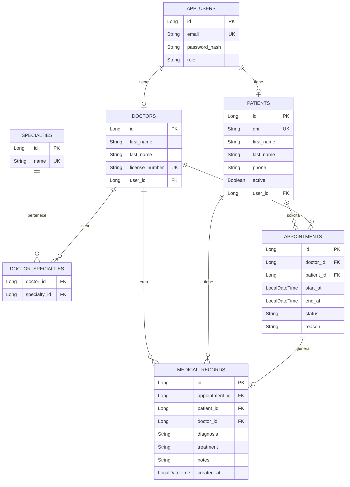

# Diagrama Entidad-Relación (ERD).

## Sistema Médico - API REST:

---

## Descripción de Entidades.

### APP_USERS:
Usuarios del sistema con autenticación JWT.
- **Roles**: ADMIN, RECEPCIONISTA, MEDICO, PACIENTE

### PATIENTS:
Pacientes registrados en el sistema.
- Pueden tener un usuario asociado (opcional)
- DNI único obligatorio

### DOCTORS:
Médicos del sistema.
- Requieren usuario con rol MEDICO
- Número de licencia único

### SPECIALTIES:
Especialidades médicas (Cardiología, Pediatría, etc.)

### APPOINTMENTS:
Citas médicas entre doctor y paciente.
- **Estados**: PROGRAMADA, COMPLETADA, CANCELADA
- Validación de solape de horarios por doctor

### MEDICAL_RECORDS:
Historiales médicos generados tras las citas.
- Vinculados a cita, paciente y doctor

---

## Relaciones:

| Relación | Tipo | Descripción |
|----------|------|-------------|
| User → Patient | 1:1 | Un usuario puede ser paciente |
| User → Doctor | 1:1 | Un usuario puede ser doctor |
| Doctor → Specialty | N:M | Doctores tienen múltiples especialidades |
| Doctor → Appointment | 1:N | Doctor atiende múltiples citas |
| Patient → Appointment | 1:N | Paciente tiene múltiples citas |
| Appointment → MedicalRecord | 1:1 | Cada cita puede generar un historial |

---

## Constraints:

- `APP_USERS.email` - UNIQUE
- `PATIENTS.dni` - UNIQUE
- `DOCTORS.license_number` - UNIQUE
- `SPECIALTIES.name` - UNIQUE
- Validación de negocio: No se permiten citas solapadas para el mismo doctor.