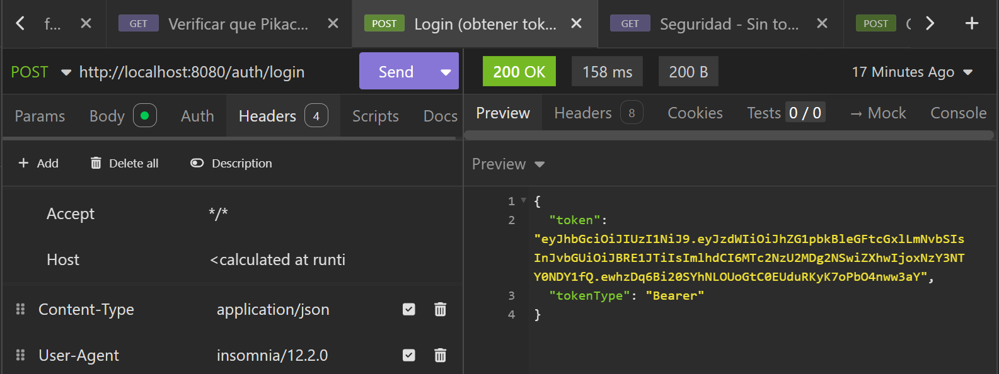
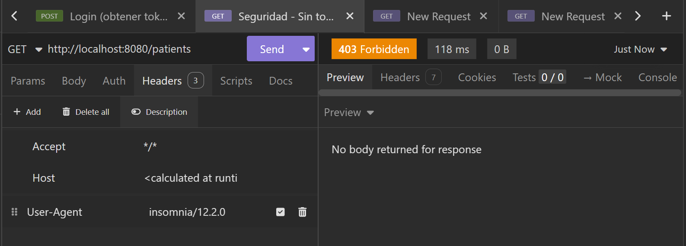
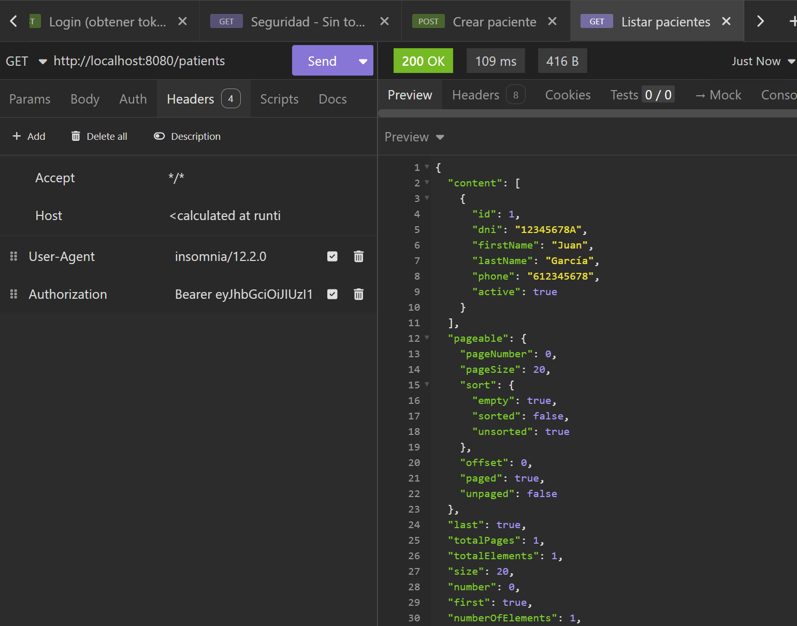
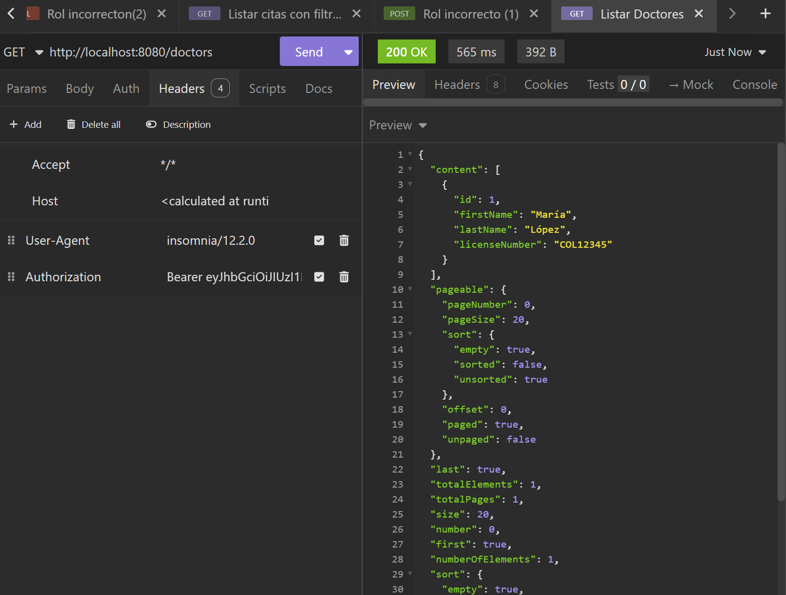
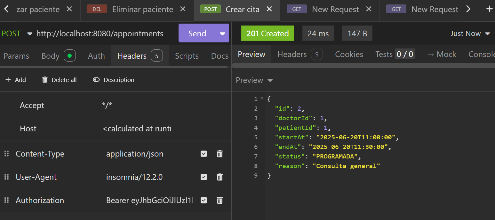
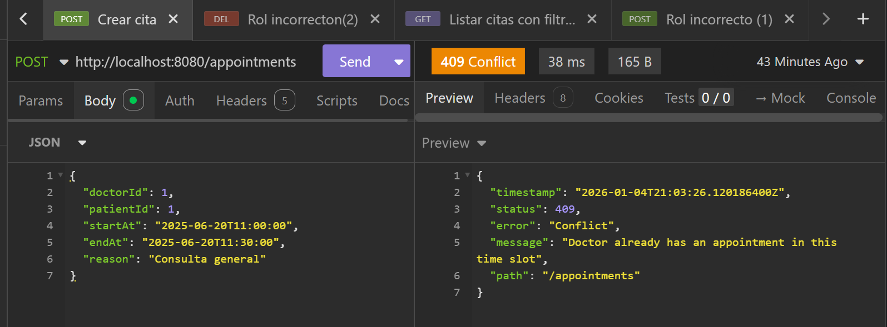
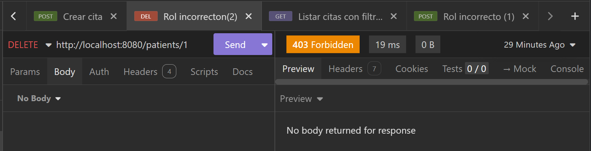
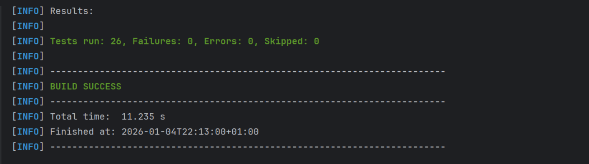

# Evidencias - API REST Sistema Médico.

## Información del Proyecto:

| Campo | Valor |
|-------|-------|
| **Proyecto** | API REST Sistema Médico |
| **Framework** | Spring Boot 3.3.3 |
| **Base de Datos** | H2 (en memoria) |
| **Seguridad** | JWT + Spring Security |
| **Java** | 21 |
| **Tests** | 26 tests (JUnit 5 + Mockito) |

---

## Arquitectura del Proyecto:

El proyecto sigue una arquitectura en capas siguiendo las mejores prácticas de Spring Boot:

```
src/main/java/com/example/medical/
├── domain/          → Entidades JPA (Patient, Doctor, Appointment, etc.)
├── dto/             → Objetos de transferencia (Request/Response)
├── error/           → Excepciones personalizadas + Handler global
├── repo/            → Repositorios Spring Data JPA
├── security/        → Configuración JWT y Spring Security
├── service/         → Lógica de negocio (interfaces + implementaciones)
└── web/             → Controladores REST
```

### Principios aplicados:
- **Separación de responsabilidades**: Controller → Service → Repository
- **DTOs**: Nunca se exponen entidades JPA directamente.
- **Inyección por constructor**: Sin `@Autowired` en campos.
- **Validación**: Uso de `@Valid` + Bean Validation.
- **Manejo de errores**: `@RestControllerAdvice` centralizado.

---

## Sistema de Autenticación y Roles.

### Usuarios del Sistema (Seed):

| Email | Contraseña | Rol |
|-------|------------|-----|
| admin@example.com | Admin1234! | ROLE_ADMIN |
| recep@example.com | Recep1234! | ROLE_RECEPCIONISTA |
| doc@example.com | Doc1234! | ROLE_MEDICO |
| pat@example.com | Pat1234! | ROLE_PACIENTE |

### Permisos por Endpoint:

| Endpoint | Roles permitidos |
|----------|------------------|
| `/auth/**` | Público |
| `/patients/**` | ADMIN, RECEPCIONISTA |
| `/appointments/**` | ADMIN, RECEPCIONISTA, MEDICO, PACIENTE |
| `/medical-records/**` | ADMIN, MEDICO |
| `/doctors/**` | ADMIN, RECEPCIONISTA, MEDICO |

### Flujo de Autenticación JWT:
1. Usuario envía credenciales a `POST /auth/login`
2. Sistema valida y genera token JWT (válido 60 minutos)
3. Cliente incluye token en header: `Authorization: Bearer <token>`
4. Filtro JWT valida token en cada petición protegida

---

## Funcionalidades Implementadas.

### CRUD Completo:
- **Pacientes**: Crear, Listar (paginado), Obtener, Actualizar, Eliminar.
- **Doctores**: Listar (paginado), Obtener por ID.
- **Citas**: Crear, Listar con filtros, Obtener, Actualizar, Eliminar.
- **Historiales Médicos**: Crear, Obtener.

### Validaciones de Negocio:
- **Solape de citas**: No permite crear citas que se solapen en el mismo doctor.
- **Tiempos válidos**: `endAt` debe ser posterior a `startAt`
- **Entidades existentes**: Verifica que doctor y paciente existan antes de crear cita.
- **DNI único**: No permite pacientes con DNI duplicado.

### Códigos HTTP Correctos:
| Operación | Código | Descripción |
|-----------|--------|-------------|
| POST (crear) | 201 Created | + Header Location |
| GET (listar/obtener) | 200 OK | |
| PUT (actualizar) | 200 OK | |
| DELETE (eliminar) | 204 No Content | |
| Recurso no encontrado | 404 Not Found | |
| Conflicto (solape) | 409 Conflict | |
| Validación fallida | 400 Bad Request | |
| Sin autenticación | 401/403 | |
| Sin permisos | 403 Forbidden | |

---

## Suite de Tests (26 tests).

### Distribución por tipo:

| Clase | Tipo | Tests | Descripción |
|-------|------|-------|-------------|
| PatientControllerTest | Controller | 5 | CRUD endpoints con MockMvc |
| JwtSecurityTest | Seguridad | 4 | Autenticación y autorización |
| JwtIntegrationTest | Seguridad | 1 | Login completo |
| AppointmentServiceTest | Servicio | 7 | Lógica de negocio con Mockito |
| AppointmentRepositoryTest | Repositorio | 4 | Queries JPA |
| IntegrationTest | Integración | 4 | Flujos completos E2E |
| MedicalApiApplicationTests | Contexto | 1 | Carga de contexto |

### Cobertura de tests:
- Tests de repositorio (`@SpringBootTest` + `@Transactional`)
- Tests de servicio (Mockito)
- Tests de controlador (`@SpringBootTest` + `@AutoConfigureMockMvc`)
- Tests de seguridad JWT
- Tests de integración completos

---

## Evidencias de Funcionamiento.

### 1. Login - Autenticación JWT:
**Endpoint:** `POST /auth/login`

**Descripción:** El sistema autentica al usuario y devuelve un token JWT válido por 60 minutos.

**Request:**
```json
{
  "email": "admin@example.com",
  "password": "Admin1234!"
}
```

**Resultado:** 200 OK + Token JWT



---

### 2. Seguridad - Acceso sin Token:
**Endpoint:** `GET /patients` (sin Authorization header)

**Descripción:** Se verifica que los endpoints protegidos rechacen peticiones sin autenticación.

**Resultado:** 403 Forbidden



---

### 3. CRUD Pacientes - Crear:
**Endpoint:** `POST /patients`

**Descripción:** Creación de un nuevo paciente con validación de campos obligatorios y respuesta 201 + Location.

**Request:**
```json
{
  "firstName": "Juan",
  "lastName": "García",
  "dni": "12345678A",
  "phone": "612345678"
}
```

**Resultado:** 201 Created


---

### 4. CRUD Pacientes - Listar con Paginación:
**Endpoint:** `GET /patients`

**Descripción:** Listado de pacientes con paginación real usando `Page<PatientResponse>`. Incluye metadata de paginación (totalElements, totalPages, size, number).

**Resultado:** 200 OK + Paginación



---

### 5. Listar Doctores:
**Endpoint:** `GET /doctors`

**Descripción:** Listado de doctores con paginación. Endpoint implementado durante el desarrollo.

**Resultado:** 200 OK



---

### 6. Crear Cita:
**Endpoint:** `POST /appointments`

**Descripción:** Creación de cita médica validando existencia de doctor y paciente.

**Request:**
```json
{
  "doctorId": 1,
  "patientId": 1,
  "startAt": "2025-06-20T10:00:00",
  "endAt": "2025-06-20T10:30:00",
  "reason": "Consulta general"
}
```

**Resultado:** 201 Created



---

### 7. Validación - Conflicto de Horario:
**Endpoint:** `POST /appointments`

**Descripción:** El sistema detecta cuando se intenta crear una cita que solapa con otra existente del mismo doctor.

**Resultado:** 409 Conflict - "Doctor already has an appointment in this time slot"



---

### 8. Filtros en Citas:
**Endpoint:** `GET /appointments?doctorId=1&status=PROGRAMADA`

**Descripción:** Listado de citas con filtros combinables: doctorId, patientId, status, dateFrom, dateTo.

**Resultado:** 200 OK + Resultados filtrados


---

### 9. Autorización - Rol Incorrecto:
**Endpoint:** `DELETE /patients/1` (con token de PACIENTE)

**Descripción:** Un usuario con rol PACIENTE intenta eliminar un paciente (operación solo permitida a ADMIN/RECEPCIONISTA).

**Resultado:** 403 Forbidden



---

### 10. Validación - Doctor No Encontrado:
**Endpoint:** `POST /appointments`

**Descripción:** Se intenta crear una cita con un doctorId que no existe en el sistema.

**Resultado:** 404 Not Found - "Doctor not found"


---

### 11. Tests - Ejecución Completa:
**Comando:** `mvn test`

**Descripción:** Ejecución de la suite completa de 26 tests.

**Resultado:** 26 tests, 0 failures, 0 errors



---


## 🚀 Instrucciones de Ejecución.

### Requisitos:
- Java 21
- Maven 3.9+

### Ejecutar aplicación:
```bash
mvn spring-boot:run
```

### Ejecutar tests:
```bash
mvn test
```

### Accesos:
- **API:** http://localhost:8080
- **H2 Console:** http://localhost:8080/h2-console
    - JDBC URL: `jdbc:h2:mem:medicaldb`
    - User: `sa`
    - Password: (vacío)
